# СИМУЛЯТОР SQL (Karpov Courses). Часть II
[Симулятор SQL от Karpov Courses](https://lab.karpov.courses/learning/152/)  
_#redash   #sql   #postgresql_

## МАРКЕТИНГОВЫЕ МЕТРИКИ


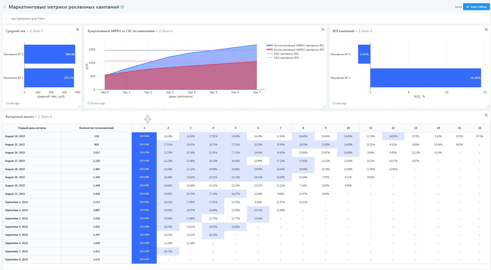

#### 2mm.6  
Для каждой **_рекламной кампании_** для каждого дня посчитайте две метрики:
1. **_Накопительный ARPPU_**.
2. Затраты на привлечение одного покупателя (**_CAC_**).

CAC в курсе считается к платящим пользователям.

```sql
WITH
    campaign_orders as (
        SELECT
            CASE
                WHEN user_id IN (8804, 9828, 9524, 9667, 9165, 10013, 9625, 8879, 9145, 8657, 8706, 9476, 9813,
                                    8940, 9971, 10122, 8732, 9689, 9198, 8896, 8815, 9689, 9075, 9071, 9528, 9896,
                                    10135, 9478, 9612, 8638, 10057, 9167, 9450, 9999, 9313, 9720, 9599, 9351, 8638,
                                    8752, 9998, 9431, 9660, 9004, 8632, 8896, 8750, 9605, 8867, 9535, 9494, 9762,
                                    8990, 9526, 9786, 9654, 9144, 9391, 10016, 8988, 9009, 9061, 9004, 9550, 8707,
                                    8788, 8988, 8853, 9836, 8810, 9916, 9660, 9677, 9896, 8933, 8828, 9108, 9180,
                                    9897, 9960, 9472, 9818, 9695, 9965, 10023, 8972, 9035, 8869, 9662, 9561, 9740,
                                    8723, 9146, 10103, 9963, 10103, 8715, 9167, 9313, 9679, 9251, 10001, 8867, 8707,
                                    9945, 9562, 10013, 9020, 9317, 9002, 9838, 9144, 8911, 9505, 9313, 10134, 9197,
                                    9398, 9652, 9999, 9210, 8741, 9963, 9422, 9778, 8815, 9512, 9794, 9019, 9287, 9561,
                                    9321, 9677, 10122, 8752, 9810, 9871, 9162, 8876, 9414, 10030, 9334, 9175, 9182,
                                    9451, 9257, 9321, 9531, 9655, 9845, 8883, 9993, 9804, 10105, 8774, 8631, 9081, 8845,
                                    9451, 9019, 8750, 8788, 9625, 9414, 10064, 9633, 9891, 8751, 8643, 9559, 8791, 9518,
                                    9968, 9726, 9036, 9085, 9603, 8909, 9454, 9739, 9223, 9420, 8830, 9615, 8859, 9887,
                                    9491, 8739, 8770, 9069, 9278, 9831, 9291, 9089, 8976, 9611, 10082, 8673, 9113, 10051)
                THEN 'Кампания № 1'
                WHEN user_id IN (9752, 9510, 8893, 9196, 10038, 9839, 9820, 9064, 9930, 9529, 9267, 9161, 9231,
                                    8953, 9863, 8878, 10078, 9370, 8675, 9961, 9007, 9207, 9539, 9335, 8700, 9598,
                                    9068, 9082, 8916, 10131, 9704, 9904, 9421, 9083, 9337, 9041, 8955, 10033, 9137,
                                    9539, 8855, 9117, 8771, 9226, 8733, 8851, 9749, 10027, 9757, 9788, 8646, 9567,
                                    9140, 9719, 10073, 9000, 8971, 9437, 9958, 8683, 9410, 10075, 8923, 9255, 8995,
                                    9343, 10059, 9082, 9267, 9929, 8670, 9570, 9281, 8795, 9082, 8814, 8795, 10067,
                                    9700, 9432, 9783, 10081, 9591, 8733, 9337, 9808, 9392, 9185, 8882, 8681, 8825,
                                    9692, 10048, 8682, 9631, 8942, 9910, 9428, 9500, 9527, 8655, 8890, 9000, 8827,
                                    9485, 9013, 9042, 10047, 8798, 9250, 8929, 9161, 9545, 9333, 9230, 9841, 8659,
                                    9181, 9880, 9983, 9538, 9483, 9557, 9883, 9901, 9103, 10110, 8827, 9530, 9310,
                                    9711, 9383, 9527, 8968, 8973, 9497, 9753, 8980, 8838, 9370, 8682, 8854, 8966,
                                    9658, 9939, 8704, 9281, 10113, 8697, 9149, 8870, 9959, 9127, 9203, 9635, 9273,
                                    9356, 10069, 9855, 8680, 9912, 8900, 9131, 10058, 9479, 9259, 9368, 9908, 9468,
                                    8902, 9292, 8742, 9672, 9564, 8949, 9404, 9183, 8913, 8694, 10092, 8771, 8805,
                                    8794, 9179, 9666, 9095, 9935, 9190, 9183, 9631, 9231, 9109, 9123, 8806, 9229,
                                    9741, 9303, 9303, 10045, 9744, 8665, 9843, 9634, 8812, 9684, 9616, 8660, 9498,
                                    9877, 9727, 9882, 8663, 9755, 8754, 9131, 9273, 9879, 9492, 9920, 9853, 8803,
                                    9711, 9885, 9560, 8886, 8644, 9636, 10073, 10106, 9859, 8943, 8849, 8629, 8729,
                                    9227, 9711, 9282, 9312, 8630, 9735, 9315, 9077, 8999, 8713, 10079, 9596, 8748,
                                    9327, 9790, 8719, 9706, 9289, 9047, 9495, 9558, 8650, 9784, 8935, 9764, 8712)
                THEN 'Кампания № 2'
                END as ads_campaign,
            user_id,
            order_id,
            time::DATE date
        FROM
            user_actions ua1
        WHERE
            NOT EXISTS (SELECT * FROM user_actions ua2
                        WHERE ua1.order_id = ua2.order_id
                        AND action = 'cancel_order')
    ),

    splited_orders as (
        SELECT
            ads_campaign,
            user_id,
            order_id,
            date,
            UNNEST (product_ids) product_id
        FROM
            campaign_orders
            LEFT JOIN orders USING (order_id)
        WHERE
            ads_campaign IS NOT NULL
    ),

    order_sums as (
        SELECT
            ads_campaign,
            date,
            SUM(price) revenue
        FROM
            splited_orders so
            LEFT JOIN products p USING (product_id)
        GROUP BY
            ads_campaign,
            date
    ),

    paying_user_counts as (
        SELECT
            ads_campaign,
            COUNT(DISTINCT user_id) paying_user_count
        FROM
            splited_orders
        GROUP BY
            ads_campaign
    )

SELECT
    ads_campaign,
    'Day ' || date - '2022-09-01' AS day,
    ROUND(SUM(revenue) OVER(PARTITION BY ads_campaign ORDER BY date) / paying_user_count, 2) cumulative_arppu,
    ROUND(250000.0 / paying_user_count, 2) cac
FROM
    order_sums
    LEFT JOIN paying_user_counts USING (ads_campaign)
WHERE
    ads_campaign IS NOT NULL
ORDER BY
    ads_campaign,
    date
```

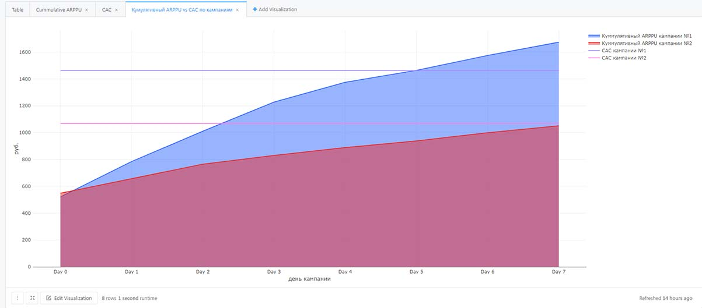


#### 2mm.5
Для каждой **_рекламной кампании_** посчитайте **_Retention 1-го и 7-го_** дня у привлечённых пользователей. 

```sql
WITH
    start_days as (
        SELECT
            user_id,
            time::date dt,
            (min(time) OVER(PARTITION BY user_id))::DATE start_date
        FROM
            user_actions
        WHERE
            user_id IN (8804, 9828, 9524, 9667, 9165, 10013, 9625, 8879, 9145, 8657, 8706, 9476, 9813,
                            8940, 9971, 10122, 8732, 9689, 9198, 8896, 8815, 9689, 9075, 9071, 9528, 9896,
                            10135, 9478, 9612, 8638, 10057, 9167, 9450, 9999, 9313, 9720, 9599, 9351, 8638,
                            8752, 9998, 9431, 9660, 9004, 8632, 8896, 8750, 9605, 8867, 9535, 9494, 9762,
                            8990, 9526, 9786, 9654, 9144, 9391, 10016, 8988, 9009, 9061, 9004, 9550, 8707,
                            8788, 8988, 8853, 9836, 8810, 9916, 9660, 9677, 9896, 8933, 8828, 9108, 9180,
                            9897, 9960, 9472, 9818, 9695, 9965, 10023, 8972, 9035, 8869, 9662, 9561, 9740,
                            8723, 9146, 10103, 9963, 10103, 8715, 9167, 9313, 9679, 9251, 10001, 8867, 8707,
                            9945, 9562, 10013, 9020, 9317, 9002, 9838, 9144, 8911, 9505, 9313, 10134, 9197,
                            9398, 9652, 9999, 9210, 8741, 9963, 9422, 9778, 8815, 9512, 9794, 9019, 9287, 9561,
                            9321, 9677, 10122, 8752, 9810, 9871, 9162, 8876, 9414, 10030, 9334, 9175, 9182,
                            9451, 9257, 9321, 9531, 9655, 9845, 8883, 9993, 9804, 10105, 8774, 8631, 9081, 8845,
                            9451, 9019, 8750, 8788, 9625, 9414, 10064, 9633, 9891, 8751, 8643, 9559, 8791, 9518,
                            9968, 9726, 9036, 9085, 9603, 8909, 9454, 9739, 9223, 9420, 8830, 9615, 8859, 9887,
                            9491, 8739, 8770, 9069, 9278, 9831, 9291, 9089, 8976, 9611, 10082, 8673, 9113, 10051,
                            9752, 9510, 8893, 9196, 10038, 9839, 9820, 9064, 9930, 9529, 9267, 9161, 9231,
                            8953, 9863, 8878, 10078, 9370, 8675, 9961, 9007, 9207, 9539, 9335, 8700, 9598,
                            9068, 9082, 8916, 10131, 9704, 9904, 9421, 9083, 9337, 9041, 8955, 10033, 9137,
                            9539, 8855, 9117, 8771, 9226, 8733, 8851, 9749, 10027, 9757, 9788, 8646, 9567,
                            9140, 9719, 10073, 9000, 8971, 9437, 9958, 8683, 9410, 10075, 8923, 9255, 8995,
                            9343, 10059, 9082, 9267, 9929, 8670, 9570, 9281, 8795, 9082, 8814, 8795, 10067,
                            9700, 9432, 9783, 10081, 9591, 8733, 9337, 9808, 9392, 9185, 8882, 8681, 8825,
                            9692, 10048, 8682, 9631, 8942, 9910, 9428, 9500, 9527, 8655, 8890, 9000, 8827,
                            9485, 9013, 9042, 10047, 8798, 9250, 8929, 9161, 9545, 9333, 9230, 9841, 8659,
                            9181, 9880, 9983, 9538, 9483, 9557, 9883, 9901, 9103, 10110, 8827, 9530, 9310,
                            9711, 9383, 9527, 8968, 8973, 9497, 9753, 8980, 8838, 9370, 8682, 8854, 8966,
                            9658, 9939, 8704, 9281, 10113, 8697, 9149, 8870, 9959, 9127, 9203, 9635, 9273,
                            9356, 10069, 9855, 8680, 9912, 8900, 9131, 10058, 9479, 9259, 9368, 9908, 9468,
                            8902, 9292, 8742, 9672, 9564, 8949, 9404, 9183, 8913, 8694, 10092, 8771, 8805,
                            8794, 9179, 9666, 9095, 9935, 9190, 9183, 9631, 9231, 9109, 9123, 8806, 9229,
                            9741, 9303, 9303, 10045, 9744, 8665, 9843, 9634, 8812, 9684, 9616, 8660, 9498,
                            9877, 9727, 9882, 8663, 9755, 8754, 9131, 9273, 9879, 9492, 9920, 9853, 8803,
                            9711, 9885, 9560, 8886, 8644, 9636, 10073, 10106, 9859, 8943, 8849, 8629, 8729,
                            9227, 9711, 9282, 9312, 8630, 9735, 9315, 9077, 8999, 8713, 10079, 9596, 8748,
                            9327, 9790, 8719, 9706, 9289, 9047, 9495, 9558, 8650, 9784, 8935, 9764, 8712)

    ),

    campaign_data as (
        SELECT
            CASE
                WHEN user_id IN (8804, 9828, 9524, 9667, 9165, 10013, 9625, 8879, 9145, 8657, 8706, 9476, 9813,
                                    8940, 9971, 10122, 8732, 9689, 9198, 8896, 8815, 9689, 9075, 9071, 9528, 9896,
                                    10135, 9478, 9612, 8638, 10057, 9167, 9450, 9999, 9313, 9720, 9599, 9351, 8638,
                                    8752, 9998, 9431, 9660, 9004, 8632, 8896, 8750, 9605, 8867, 9535, 9494, 9762,
                                    8990, 9526, 9786, 9654, 9144, 9391, 10016, 8988, 9009, 9061, 9004, 9550, 8707,
                                    8788, 8988, 8853, 9836, 8810, 9916, 9660, 9677, 9896, 8933, 8828, 9108, 9180,
                                    9897, 9960, 9472, 9818, 9695, 9965, 10023, 8972, 9035, 8869, 9662, 9561, 9740,
                                    8723, 9146, 10103, 9963, 10103, 8715, 9167, 9313, 9679, 9251, 10001, 8867, 8707,
                                    9945, 9562, 10013, 9020, 9317, 9002, 9838, 9144, 8911, 9505, 9313, 10134, 9197,
                                    9398, 9652, 9999, 9210, 8741, 9963, 9422, 9778, 8815, 9512, 9794, 9019, 9287, 9561,
                                    9321, 9677, 10122, 8752, 9810, 9871, 9162, 8876, 9414, 10030, 9334, 9175, 9182,
                                    9451, 9257, 9321, 9531, 9655, 9845, 8883, 9993, 9804, 10105, 8774, 8631, 9081, 8845,
                                    9451, 9019, 8750, 8788, 9625, 9414, 10064, 9633, 9891, 8751, 8643, 9559, 8791, 9518,
                                    9968, 9726, 9036, 9085, 9603, 8909, 9454, 9739, 9223, 9420, 8830, 9615, 8859, 9887,
                                    9491, 8739, 8770, 9069, 9278, 9831, 9291, 9089, 8976, 9611, 10082, 8673, 9113, 10051)
                THEN 'Кампания № 1'
                WHEN user_id IN (9752, 9510, 8893, 9196, 10038, 9839, 9820, 9064, 9930, 9529, 9267, 9161, 9231,
                                    8953, 9863, 8878, 10078, 9370, 8675, 9961, 9007, 9207, 9539, 9335, 8700, 9598,
                                    9068, 9082, 8916, 10131, 9704, 9904, 9421, 9083, 9337, 9041, 8955, 10033, 9137,
                                    9539, 8855, 9117, 8771, 9226, 8733, 8851, 9749, 10027, 9757, 9788, 8646, 9567,
                                    9140, 9719, 10073, 9000, 8971, 9437, 9958, 8683, 9410, 10075, 8923, 9255, 8995,
                                    9343, 10059, 9082, 9267, 9929, 8670, 9570, 9281, 8795, 9082, 8814, 8795, 10067,
                                    9700, 9432, 9783, 10081, 9591, 8733, 9337, 9808, 9392, 9185, 8882, 8681, 8825,
                                    9692, 10048, 8682, 9631, 8942, 9910, 9428, 9500, 9527, 8655, 8890, 9000, 8827,
                                    9485, 9013, 9042, 10047, 8798, 9250, 8929, 9161, 9545, 9333, 9230, 9841, 8659,
                                    9181, 9880, 9983, 9538, 9483, 9557, 9883, 9901, 9103, 10110, 8827, 9530, 9310,
                                    9711, 9383, 9527, 8968, 8973, 9497, 9753, 8980, 8838, 9370, 8682, 8854, 8966,
                                    9658, 9939, 8704, 9281, 10113, 8697, 9149, 8870, 9959, 9127, 9203, 9635, 9273,
                                    9356, 10069, 9855, 8680, 9912, 8900, 9131, 10058, 9479, 9259, 9368, 9908, 9468,
                                    8902, 9292, 8742, 9672, 9564, 8949, 9404, 9183, 8913, 8694, 10092, 8771, 8805,
                                    8794, 9179, 9666, 9095, 9935, 9190, 9183, 9631, 9231, 9109, 9123, 8806, 9229,
                                    9741, 9303, 9303, 10045, 9744, 8665, 9843, 9634, 8812, 9684, 9616, 8660, 9498,
                                    9877, 9727, 9882, 8663, 9755, 8754, 9131, 9273, 9879, 9492, 9920, 9853, 8803,
                                    9711, 9885, 9560, 8886, 8644, 9636, 10073, 10106, 9859, 8943, 8849, 8629, 8729,
                                    9227, 9711, 9282, 9312, 8630, 9735, 9315, 9077, 8999, 8713, 10079, 9596, 8748,
                                    9327, 9790, 8719, 9706, 9289, 9047, 9495, 9558, 8650, 9784, 8935, 9764, 8712)
                THEN 'Кампания № 2'
                END as ads_campaign,
            user_id,
            start_date,
            dt - start_date day_number
        FROM
            start_days
    )

SELECT
    ads_campaign,
    start_date,
    day_number,
    round(count(distinct user_id)::decimal / max(count(distinct user_id)) OVER(PARTITION BY ads_campaign, start_date), 2) retention
FROM
    campaign_data
GROUP BY
    ads_campaign,
    start_date,
    day_number
HAVING
    day_number IN (0, 1, 7)
```

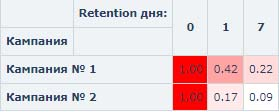


#### 2mm.4
Рассчитайте **_показатель дневного Retention_** для всех пользователей, 
разбив их на когорты по дате первого взаимодействия с нашим приложением.

```sql
WITH
    start_days as (
        SELECT
            user_id,
            time::date dt,
            (min(time) OVER(PARTITION BY user_id))::DATE start_date
        FROM
            user_actions
    )

SELECT
    date_trunc('month', start_date)::date start_month,
    start_date,
    dt - start_date day_number,
    round(count(distinct user_id)::decimal / max(count(distinct user_id)) OVER(PARTITION BY start_date), 2) retention
FROM
    start_days
GROUP BY
    start_month,
    start_date,
    day_number
```

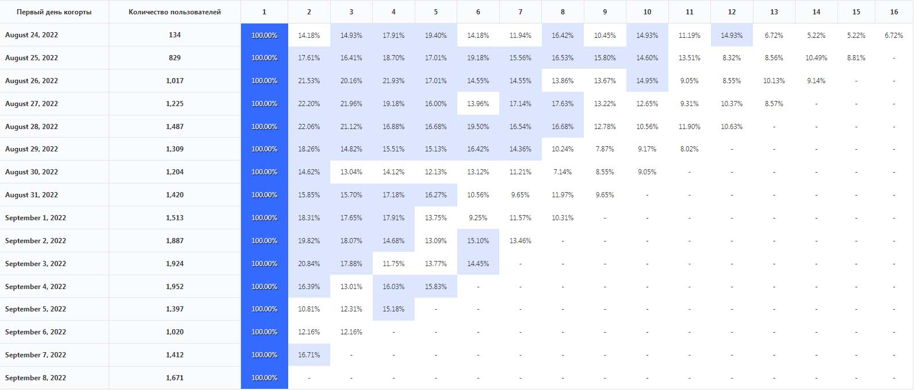


#### 2mm.3
**_Для каждой рекламной кампании посчитайте среднюю стоимость заказа_** привлечённых пользователей 
за первую неделю использования приложения с 1 по 7 сентября 2022 года.

```sql
WITH
    campaign_1_users as(
        SELECT
            UNNEST(ARRAY[
                8804, 9828, 9524, 9667, 9165, 10013, 9625, 8879, 9145, 8657, 8706, 9476, 9813,
                8940, 9971, 10122, 8732, 9689, 9198, 8896, 8815, 9689, 9075, 9071, 9528, 9896,
                10135, 9478, 9612, 8638, 10057, 9167, 9450, 9999, 9313, 9720, 9599, 9351, 8638,
                8752, 9998, 9431, 9660, 9004, 8632, 8896, 8750, 9605, 8867, 9535, 9494, 9762,
                8990, 9526, 9786, 9654, 9144, 9391, 10016, 8988, 9009, 9061, 9004, 9550, 8707,
                8788, 8988, 8853, 9836, 8810, 9916, 9660, 9677, 9896, 8933, 8828, 9108, 9180,
                9897, 9960, 9472, 9818, 9695, 9965, 10023, 8972, 9035, 8869, 9662, 9561, 9740,
                8723, 9146, 10103, 9963, 10103, 8715, 9167, 9313, 9679, 9251, 10001, 8867, 8707,
                9945, 9562, 10013, 9020, 9317, 9002, 9838, 9144, 8911, 9505, 9313, 10134, 9197,
                9398, 9652, 9999, 9210, 8741, 9963, 9422, 9778, 8815, 9512, 9794, 9019, 9287, 9561,
                9321, 9677, 10122, 8752, 9810, 9871, 9162, 8876, 9414, 10030, 9334, 9175, 9182,
                9451, 9257, 9321, 9531, 9655, 9845, 8883, 9993, 9804, 10105, 8774, 8631, 9081, 8845,
                9451, 9019, 8750, 8788, 9625, 9414, 10064, 9633, 9891, 8751, 8643, 9559, 8791, 9518,
                9968, 9726, 9036, 9085, 9603, 8909, 9454, 9739, 9223, 9420, 8830, 9615, 8859, 9887,
                9491, 8739, 8770, 9069, 9278, 9831, 9291, 9089, 8976, 9611, 10082, 8673, 9113, 10051
            ])
    ),

    campaign_2_users as(
        SELECT
            UNNEST(ARRAY[
                9752, 9510, 8893, 9196, 10038, 9839, 9820, 9064, 9930, 9529, 9267, 9161, 9231,
                8953, 9863, 8878, 10078, 9370, 8675, 9961, 9007, 9207, 9539, 9335, 8700, 9598,
                9068, 9082, 8916, 10131, 9704, 9904, 9421, 9083, 9337, 9041, 8955, 10033, 9137,
                9539, 8855, 9117, 8771, 9226, 8733, 8851, 9749, 10027, 9757, 9788, 8646, 9567,
                9140, 9719, 10073, 9000, 8971, 9437, 9958, 8683, 9410, 10075, 8923, 9255, 8995,
                9343, 10059, 9082, 9267, 9929, 8670, 9570, 9281, 8795, 9082, 8814, 8795, 10067,
                9700, 9432, 9783, 10081, 9591, 8733, 9337, 9808, 9392, 9185, 8882, 8681, 8825,
                9692, 10048, 8682, 9631, 8942, 9910, 9428, 9500, 9527, 8655, 8890, 9000, 8827,
                9485, 9013, 9042, 10047, 8798, 9250, 8929, 9161, 9545, 9333, 9230, 9841, 8659,
                9181, 9880, 9983, 9538, 9483, 9557, 9883, 9901, 9103, 10110, 8827, 9530, 9310,
                9711, 9383, 9527, 8968, 8973, 9497, 9753, 8980, 8838, 9370, 8682, 8854, 8966,
                9658, 9939, 8704, 9281, 10113, 8697, 9149, 8870, 9959, 9127, 9203, 9635, 9273,
                9356, 10069, 9855, 8680, 9912, 8900, 9131, 10058, 9479, 9259, 9368, 9908, 9468,
                8902, 9292, 8742, 9672, 9564, 8949, 9404, 9183, 8913, 8694, 10092, 8771, 8805,
                8794, 9179, 9666, 9095, 9935, 9190, 9183, 9631, 9231, 9109, 9123, 8806, 9229,
                9741, 9303, 9303, 10045, 9744, 8665, 9843, 9634, 8812, 9684, 9616, 8660, 9498,
                9877, 9727, 9882, 8663, 9755, 8754, 9131, 9273, 9879, 9492, 9920, 9853, 8803,
                9711, 9885, 9560, 8886, 8644, 9636, 10073, 10106, 9859, 8943, 8849, 8629, 8729,
                9227, 9711, 9282, 9312, 8630, 9735, 9315, 9077, 8999, 8713, 10079, 9596, 8748,
                9327, 9790, 8719, 9706, 9289, 9047, 9495, 9558, 8650, 9784, 8935, 9764, 8712
            ])
    ),

    campaign_user_actions as(
        SELECT
            CASE
                WHEN user_id IN (SELECT DISTINCT * FROM campaign_1_users)
                THEN 'Кампания № 1'
                WHEN user_id IN (SELECT DISTINCT * FROM campaign_2_users)
                THEN 'Кампания № 2'
                END as ads_campaign,
            *
        FROM
            user_actions ua1
        WHERE
            not exists (SELECT *
                        FROM user_actions ua2
                        WHERE action = 'cancel_order'
                                and ua1.order_id = ua2.order_id)
            and time between '2022-09-01'and '2022-09-08'
            and user_id IN (
                            SELECT DISTINCT * FROM campaign_1_users
                            UNION
                            SELECT DISTINCT * FROM campaign_2_users
                        )
    ),

    splited_orders as(
        SELECT
            ads_campaign,
            user_id,
            order_id,
            unnest (product_ids) product_id
        FROM
            orders
            JOIN campaign_user_actions using(order_id)
    ),

    avg_user_checks as (
        SELECT
            ads_campaign,
            sum(price) / count(distinct order_id) avg_user_check
        FROM
            splited_orders so
            LEFT JOIN products p USING(product_id)
        GROUP BY
            ads_campaign, user_id
    )

SELECT
    ads_campaign,
    round(avg(avg_user_check), 2) avg_check
FROM
    avg_user_checks
GROUP BY
    ads_campaign
ORDER BY
    avg_check desc
```

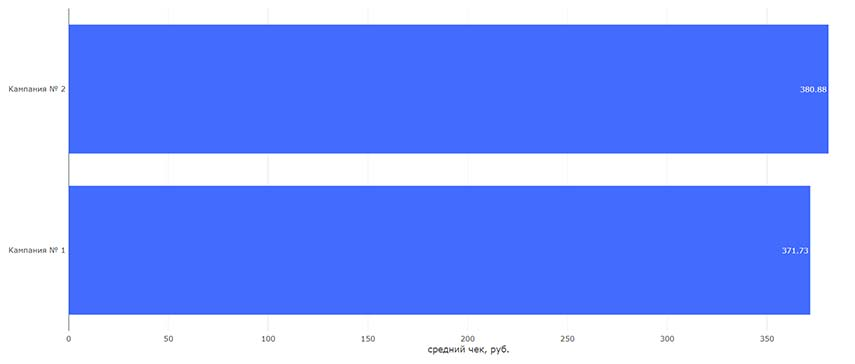


#### 2mm.2
**_Рассчитайте ROI для каждого рекламного канала_**.

```sql
WITH
    campaign_user_actions as(
        SELECT
            CASE
                WHEN user_id IN (8804, 9828, 9524, 9667, 9165, 10013, 9625, 8879, 9145, 8657, 8706, 9476, 9813,
                                    8940, 9971, 10122, 8732, 9689, 9198, 8896, 8815, 9689, 9075, 9071, 9528, 9896,
                                    10135, 9478, 9612, 8638, 10057, 9167, 9450, 9999, 9313, 9720, 9599, 9351, 8638,
                                    8752, 9998, 9431, 9660, 9004, 8632, 8896, 8750, 9605, 8867, 9535, 9494, 9762,
                                    8990, 9526, 9786, 9654, 9144, 9391, 10016, 8988, 9009, 9061, 9004, 9550, 8707,
                                    8788, 8988, 8853, 9836, 8810, 9916, 9660, 9677, 9896, 8933, 8828, 9108, 9180,
                                    9897, 9960, 9472, 9818, 9695, 9965, 10023, 8972, 9035, 8869, 9662, 9561, 9740,
                                    8723, 9146, 10103, 9963, 10103, 8715, 9167, 9313, 9679, 9251, 10001, 8867, 8707,
                                    9945, 9562, 10013, 9020, 9317, 9002, 9838, 9144, 8911, 9505, 9313, 10134, 9197,
                                    9398, 9652, 9999, 9210, 8741, 9963, 9422, 9778, 8815, 9512, 9794, 9019, 9287, 9561,
                                    9321, 9677, 10122, 8752, 9810, 9871, 9162, 8876, 9414, 10030, 9334, 9175, 9182,
                                    9451, 9257, 9321, 9531, 9655, 9845, 8883, 9993, 9804, 10105, 8774, 8631, 9081, 8845,
                                    9451, 9019, 8750, 8788, 9625, 9414, 10064, 9633, 9891, 8751, 8643, 9559, 8791, 9518,
                                    9968, 9726, 9036, 9085, 9603, 8909, 9454, 9739, 9223, 9420, 8830, 9615, 8859, 9887,
                                    9491, 8739, 8770, 9069, 9278, 9831, 9291, 9089, 8976, 9611, 10082, 8673, 9113, 10051)
                THEN 'Кампания № 1'
                WHEN user_id IN (9752, 9510, 8893, 9196, 10038, 9839, 9820, 9064, 9930, 9529, 9267, 9161, 9231,
                                    8953, 9863, 8878, 10078, 9370, 8675, 9961, 9007, 9207, 9539, 9335, 8700, 9598,
                                    9068, 9082, 8916, 10131, 9704, 9904, 9421, 9083, 9337, 9041, 8955, 10033, 9137,
                                    9539, 8855, 9117, 8771, 9226, 8733, 8851, 9749, 10027, 9757, 9788, 8646, 9567,
                                    9140, 9719, 10073, 9000, 8971, 9437, 9958, 8683, 9410, 10075, 8923, 9255, 8995,
                                    9343, 10059, 9082, 9267, 9929, 8670, 9570, 9281, 8795, 9082, 8814, 8795, 10067,
                                    9700, 9432, 9783, 10081, 9591, 8733, 9337, 9808, 9392, 9185, 8882, 8681, 8825,
                                    9692, 10048, 8682, 9631, 8942, 9910, 9428, 9500, 9527, 8655, 8890, 9000, 8827,
                                    9485, 9013, 9042, 10047, 8798, 9250, 8929, 9161, 9545, 9333, 9230, 9841, 8659,
                                    9181, 9880, 9983, 9538, 9483, 9557, 9883, 9901, 9103, 10110, 8827, 9530, 9310,
                                    9711, 9383, 9527, 8968, 8973, 9497, 9753, 8980, 8838, 9370, 8682, 8854, 8966,
                                    9658, 9939, 8704, 9281, 10113, 8697, 9149, 8870, 9959, 9127, 9203, 9635, 9273,
                                    9356, 10069, 9855, 8680, 9912, 8900, 9131, 10058, 9479, 9259, 9368, 9908, 9468,
                                    8902, 9292, 8742, 9672, 9564, 8949, 9404, 9183, 8913, 8694, 10092, 8771, 8805,
                                    8794, 9179, 9666, 9095, 9935, 9190, 9183, 9631, 9231, 9109, 9123, 8806, 9229,
                                    9741, 9303, 9303, 10045, 9744, 8665, 9843, 9634, 8812, 9684, 9616, 8660, 9498,
                                    9877, 9727, 9882, 8663, 9755, 8754, 9131, 9273, 9879, 9492, 9920, 9853, 8803,
                                    9711, 9885, 9560, 8886, 8644, 9636, 10073, 10106, 9859, 8943, 8849, 8629, 8729,
                                    9227, 9711, 9282, 9312, 8630, 9735, 9315, 9077, 8999, 8713, 10079, 9596, 8748,
                                    9327, 9790, 8719, 9706, 9289, 9047, 9495, 9558, 8650, 9784, 8935, 9764, 8712)
                THEN 'Кампания № 2'
                END as ads_campaign,
            *
        FROM
            user_actions ua1
        WHERE
            not exists (SELECT *
                        FROM user_actions ua2
                        WHERE action = 'cancel_order'
                                and ua1.order_id = ua2.order_id)
            and time > '2022-09-01'
            and user_id IN (8804, 9828, 9524, 9667, 9165, 10013, 9625, 8879, 9145, 8657, 8706, 9476, 9813,
                            8940, 9971, 10122, 8732, 9689, 9198, 8896, 8815, 9689, 9075, 9071, 9528, 9896,
                            10135, 9478, 9612, 8638, 10057, 9167, 9450, 9999, 9313, 9720, 9599, 9351, 8638,
                            8752, 9998, 9431, 9660, 9004, 8632, 8896, 8750, 9605, 8867, 9535, 9494, 9762,
                            8990, 9526, 9786, 9654, 9144, 9391, 10016, 8988, 9009, 9061, 9004, 9550, 8707,
                            8788, 8988, 8853, 9836, 8810, 9916, 9660, 9677, 9896, 8933, 8828, 9108, 9180,
                            9897, 9960, 9472, 9818, 9695, 9965, 10023, 8972, 9035, 8869, 9662, 9561, 9740,
                            8723, 9146, 10103, 9963, 10103, 8715, 9167, 9313, 9679, 9251, 10001, 8867, 8707,
                            9945, 9562, 10013, 9020, 9317, 9002, 9838, 9144, 8911, 9505, 9313, 10134, 9197,
                            9398, 9652, 9999, 9210, 8741, 9963, 9422, 9778, 8815, 9512, 9794, 9019, 9287, 9561,
                            9321, 9677, 10122, 8752, 9810, 9871, 9162, 8876, 9414, 10030, 9334, 9175, 9182,
                            9451, 9257, 9321, 9531, 9655, 9845, 8883, 9993, 9804, 10105, 8774, 8631, 9081, 8845,
                            9451, 9019, 8750, 8788, 9625, 9414, 10064, 9633, 9891, 8751, 8643, 9559, 8791, 9518,
                            9968, 9726, 9036, 9085, 9603, 8909, 9454, 9739, 9223, 9420, 8830, 9615, 8859, 9887,
                            9491, 8739, 8770, 9069, 9278, 9831, 9291, 9089, 8976, 9611, 10082, 8673, 9113, 10051,
                            9752, 9510, 8893, 9196, 10038, 9839, 9820, 9064, 9930, 9529, 9267, 9161, 9231,
                            8953, 9863, 8878, 10078, 9370, 8675, 9961, 9007, 9207, 9539, 9335, 8700, 9598,
                            9068, 9082, 8916, 10131, 9704, 9904, 9421, 9083, 9337, 9041, 8955, 10033, 9137,
                            9539, 8855, 9117, 8771, 9226, 8733, 8851, 9749, 10027, 9757, 9788, 8646, 9567,
                            9140, 9719, 10073, 9000, 8971, 9437, 9958, 8683, 9410, 10075, 8923, 9255, 8995,
                            9343, 10059, 9082, 9267, 9929, 8670, 9570, 9281, 8795, 9082, 8814, 8795, 10067,
                            9700, 9432, 9783, 10081, 9591, 8733, 9337, 9808, 9392, 9185, 8882, 8681, 8825,
                            9692, 10048, 8682, 9631, 8942, 9910, 9428, 9500, 9527, 8655, 8890, 9000, 8827,
                            9485, 9013, 9042, 10047, 8798, 9250, 8929, 9161, 9545, 9333, 9230, 9841, 8659,
                            9181, 9880, 9983, 9538, 9483, 9557, 9883, 9901, 9103, 10110, 8827, 9530, 9310,
                            9711, 9383, 9527, 8968, 8973, 9497, 9753, 8980, 8838, 9370, 8682, 8854, 8966,
                            9658, 9939, 8704, 9281, 10113, 8697, 9149, 8870, 9959, 9127, 9203, 9635, 9273,
                            9356, 10069, 9855, 8680, 9912, 8900, 9131, 10058, 9479, 9259, 9368, 9908, 9468,
                            8902, 9292, 8742, 9672, 9564, 8949, 9404, 9183, 8913, 8694, 10092, 8771, 8805,
                            8794, 9179, 9666, 9095, 9935, 9190, 9183, 9631, 9231, 9109, 9123, 8806, 9229,
                            9741, 9303, 9303, 10045, 9744, 8665, 9843, 9634, 8812, 9684, 9616, 8660, 9498,
                            9877, 9727, 9882, 8663, 9755, 8754, 9131, 9273, 9879, 9492, 9920, 9853, 8803,
                            9711, 9885, 9560, 8886, 8644, 9636, 10073, 10106, 9859, 8943, 8849, 8629, 8729,
                            9227, 9711, 9282, 9312, 8630, 9735, 9315, 9077, 8999, 8713, 10079, 9596, 8748,
                            9327, 9790, 8719, 9706, 9289, 9047, 9495, 9558, 8650, 9784, 8935, 9764, 8712)
    ),

    splited_orders as(
        SELECT
            ads_campaign,
            unnest (product_ids) product_id
        FROM
            orders
            JOIN campaign_user_actions using(order_id)
    )


SELECT
    ads_campaign,
    round(100 * (sum(price) - 250000) / 250000, 2) as roi
FROM
    splited_orders so
    LEFT JOIN products p USING(product_id)
GROUP BY
    ads_campaign
ORDER BY
    roi desc
```

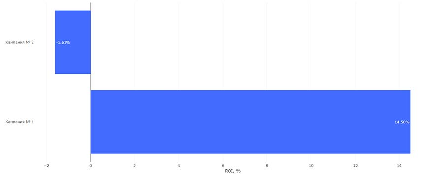


#### 2mm.1
Рассчитайте метрику **_CAC для двух рекламных кампаний_**.  
CAC в курсе считается к платящим пользователям.

```sql
SELECT
    'Кампания № 1' as ads_campaign,
    ROUND(250000.0 / COUNT(DISTINCT user_id), 2) as cac
FROM
    user_actions
WHERE
    user_id IN (8804, 9828, 9524, 9667, 9165, 10013, 9625, 8879, 9145, 8657, 8706, 9476, 9813,
                    8940, 9971, 10122, 8732, 9689, 9198, 8896, 8815, 9689, 9075, 9071, 9528, 9896,
                    10135, 9478, 9612, 8638, 10057, 9167, 9450, 9999, 9313, 9720, 9599, 9351, 8638,
                    8752, 9998, 9431, 9660, 9004, 8632, 8896, 8750, 9605, 8867, 9535, 9494, 9762,
                    8990, 9526, 9786, 9654, 9144, 9391, 10016, 8988, 9009, 9061, 9004, 9550, 8707,
                    8788, 8988, 8853, 9836, 8810, 9916, 9660, 9677, 9896, 8933, 8828, 9108, 9180,
                    9897, 9960, 9472, 9818, 9695, 9965, 10023, 8972, 9035, 8869, 9662, 9561, 9740,
                    8723, 9146, 10103, 9963, 10103, 8715, 9167, 9313, 9679, 9251, 10001, 8867, 8707,
                    9945, 9562, 10013, 9020, 9317, 9002, 9838, 9144, 8911, 9505, 9313, 10134, 9197,
                    9398, 9652, 9999, 9210, 8741, 9963, 9422, 9778, 8815, 9512, 9794, 9019, 9287, 9561,
                    9321, 9677, 10122, 8752, 9810, 9871, 9162, 8876, 9414, 10030, 9334, 9175, 9182,
                    9451, 9257, 9321, 9531, 9655, 9845, 8883, 9993, 9804, 10105, 8774, 8631, 9081, 8845,
                    9451, 9019, 8750, 8788, 9625, 9414, 10064, 9633, 9891, 8751, 8643, 9559, 8791, 9518,
                    9968, 9726, 9036, 9085, 9603, 8909, 9454, 9739, 9223, 9420, 8830, 9615, 8859, 9887,
                    9491, 8739, 8770, 9069, 9278, 9831, 9291, 9089, 8976, 9611, 10082, 8673, 9113, 10051)
    and order_id NOT IN (SELECT order_id FROM user_actions WHERE action = 'cancel_order')

UNION

SELECT
    'Кампания № 2' as ads_campaign,
    ROUND(250000.0 / COUNT(DISTINCT user_id), 2) as cac
FROM
    user_actions
WHERE
    user_id IN (9752, 9510, 8893, 9196, 10038, 9839, 9820, 9064, 9930, 9529, 9267, 9161, 9231,
                8953, 9863, 8878, 10078, 9370, 8675, 9961, 9007, 9207, 9539, 9335, 8700, 9598,
                9068, 9082, 8916, 10131, 9704, 9904, 9421, 9083, 9337, 9041, 8955, 10033, 9137,
                9539, 8855, 9117, 8771, 9226, 8733, 8851, 9749, 10027, 9757, 9788, 8646, 9567,
                9140, 9719, 10073, 9000, 8971, 9437, 9958, 8683, 9410, 10075, 8923, 9255, 8995,
                9343, 10059, 9082, 9267, 9929, 8670, 9570, 9281, 8795, 9082, 8814, 8795, 10067,
                9700, 9432, 9783, 10081, 9591, 8733, 9337, 9808, 9392, 9185, 8882, 8681, 8825,
                9692, 10048, 8682, 9631, 8942, 9910, 9428, 9500, 9527, 8655, 8890, 9000, 8827,
                9485, 9013, 9042, 10047, 8798, 9250, 8929, 9161, 9545, 9333, 9230, 9841, 8659,
                9181, 9880, 9983, 9538, 9483, 9557, 9883, 9901, 9103, 10110, 8827, 9530, 9310,
                9711, 9383, 9527, 8968, 8973, 9497, 9753, 8980, 8838, 9370, 8682, 8854, 8966,
                9658, 9939, 8704, 9281, 10113, 8697, 9149, 8870, 9959, 9127, 9203, 9635, 9273,
                9356, 10069, 9855, 8680, 9912, 8900, 9131, 10058, 9479, 9259, 9368, 9908, 9468,
                8902, 9292, 8742, 9672, 9564, 8949, 9404, 9183, 8913, 8694, 10092, 8771, 8805,
                8794, 9179, 9666, 9095, 9935, 9190, 9183, 9631, 9231, 9109, 9123, 8806, 9229,
                9741, 9303, 9303, 10045, 9744, 8665, 9843, 9634, 8812, 9684, 9616, 8660, 9498,
                9877, 9727, 9882, 8663, 9755, 8754, 9131, 9273, 9879, 9492, 9920, 9853, 8803,
                9711, 9885, 9560, 8886, 8644, 9636, 10073, 10106, 9859, 8943, 8849, 8629, 8729,
                9227, 9711, 9282, 9312, 8630, 9735, 9315, 9077, 8999, 8713, 10079, 9596, 8748,
                9327, 9790, 8719, 9706, 9289, 9047, 9495, 9558, 8650, 9784, 8935, 9764, 8712)
    and order_id NOT IN (SELECT order_id FROM user_actions WHERE action = 'cancel_order')
```

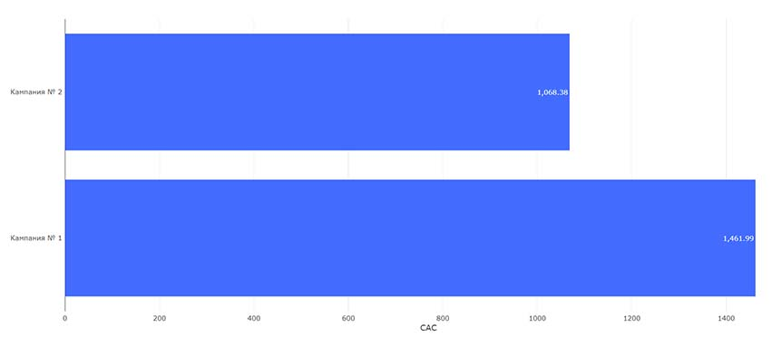


## ЭКОНОМИКА ПРОДУКТА

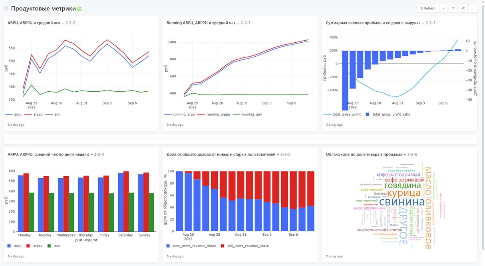

#### 2.7
**_Для каждого дня_** рассчитайте следующие показатели:
- **_Выручку_**, полученную в этот день.
- **_Затраты_**, образовавшиеся в этот день.
- Сумму **_НДС_** с продажи товаров в этот день.
- Валовую **_прибыль_** в этот день (выручка за вычетом затрат и НДС).
- **_Суммарную выручку на текущий день_**.
- **_Суммарные затраты_** на текущий день.
- **_Суммарный НДС_** на текущий день.
- **_Суммарную валовую прибыль_** на текущий день.
- **_Долю_** валовой **_прибыли в выручке_** за этот день (долю п.4 в п.1).
- **_Долю суммарной валовой прибыли в суммарной выручке_** на текущий день (долю п.8 в п.5).

К постоянным издержкам отнесём аренду складских помещений, а к переменным — стоимость сборки и доставки заказа. 
Из данных, которые нам предоставил финансовый отдел, известно, что в августе 2022 года постоянные затраты составляли 
120 000 рублей в день. Однако уже в сентябре нашему сервису потребовались дополнительные помещения, 
и поэтому постоянные затраты возросли до 150 000 рублей в день. 
Также известно, что в августе 2022 года сборка одного заказа обходилась нам в 140 рублей, при этом курьерам мы платили 
по 150 рублей за один доставленный заказ и ещё 400 рублей ежедневно в качестве бонуса, если курьер доставлял 
не менее 5 заказов в день. В сентябре продакт-менеджерам удалось снизить затраты на сборку заказа до 115 рублей, 
но при этом пришлось повысить бонусную выплату за доставку 5 и более заказов до 500 рублей, чтобы обеспечить 
более конкурентоспособные условия труда. При этом в сентябре выплата курьерам за один доставленный заказ 
осталась неизменной.

```sql
WITH
    product_prices_and_vat as (
        SELECT
            product_id,
            price,
            CASE
                WHEN name IN ('сахар', 'сухарики', 'сушки', 'семечки',
                                'масло льняное', 'виноград', 'масло оливковое',
                                'арбуз', 'батон', 'йогурт', 'сливки', 'гречка',
                                'овсянка', 'макароны', 'баранина', 'апельсины',
                                'бублики', 'хлеб', 'горох', 'сметана', 'рыба копченая',
                                'мука', 'шпроты', 'сосиски', 'свинина', 'рис',
                                'масло кунжутное', 'сгущенка', 'ананас', 'говядина',
                                'соль', 'рыба вяленая', 'масло подсолнечное', 'яблоки',
                                'груши', 'лепешка', 'молоко', 'курица', 'лаваш', 'вафли',
                                'мандарины')
                THEN ROUND(price / 1.1 * 0.1, 2)
                ELSE ROUND(price / 1.2 * 0.2, 2)
                END as vat
        FROM
            products
    ),

    splited_orders as (
        SELECT
            creation_time::date date,
            order_id,
            unnest (product_ids) product_id
        FROM
            orders
        WHERE
            not exists (SELECT *
                        FROM user_actions
                        WHERE  action = 'cancel_order'
                                and orders.order_id = user_actions.order_id)
    ),

    access_sums as (
        SELECT
            date,
            sum(price) total,
            sum(vat) total_vat,
            CASE
                WHEN date < '2022-09-01' THEN COUNT(DISTINCT order_id) * 140
                ELSE COUNT(DISTINCT order_id) * 115
                END as assembly_costs,
            CASE
                WHEN date < '2022-09-01' THEN 120000
                ELSE 150000
                END as rental_costs
        FROM
            splited_orders
            LEFT JOIN product_prices_and_vat using (product_id)
        GROUP BY
            date
    ),

    delivery_by_working_shift as (
        SELECT
            time::date date,
            COUNT(order_id) delivered_orders
        FROM
            courier_actions
        WHERE
            action = 'deliver_order'
        GROUP BY
            date,
            courier_id
    ),

    delivery_costs as (
        SELECT
            date,
            SUM(delivered_orders) * 150 as delivery_cost
        FROM
            delivery_by_working_shift
        GROUP BY
            date
    ),

    delivery_bonuses as (
        SELECT
            date,
            CASE
                WHEN date < '2022-09-01' THEN COUNT(delivered_orders) * 400
                ELSE COUNT(delivered_orders) * 500
                END as delivery_bonus
        FROM
            delivery_by_working_shift
        WHERE
            delivered_orders > 4
        GROUP BY
            date
    ),

    sum_metrics as (
        SELECT
            date,
            total as revenue,
            assembly_costs + rental_costs + delivery_cost + coalesce(delivery_bonus, 0) as costs,
            total_vat as tax
        FROM
            access_sums
            LEFT JOIN delivery_costs USING (date)
            LEFT JOIN delivery_bonuses USING (date)
    ),

    rolling_metrics as (
        SELECT
            date,
            revenue,
            costs,
            tax,
            revenue - costs - tax as gross_profit,
            SUM(revenue) OVER(ORDER BY date) as total_revenue,
            SUM(costs) OVER(ORDER BY date) as total_costs,
            SUM(tax) OVER(ORDER BY date) as total_tax,
            SUM(revenue - costs - tax) OVER(ORDER BY date) as total_gross_profit
        FROM
            sum_metrics
    )

SELECT
    date,
    revenue,
    costs,
    tax,
    gross_profit,
    total_revenue,
    total_costs,
    total_tax,
    total_gross_profit,
    ROUND(100 * gross_profit / revenue, 2) as gross_profit_ratio,
    ROUND(100 * total_gross_profit / total_revenue, 2) as total_gross_profit_ratio
FROM
    rolling_metrics
ORDER BY
    date
```

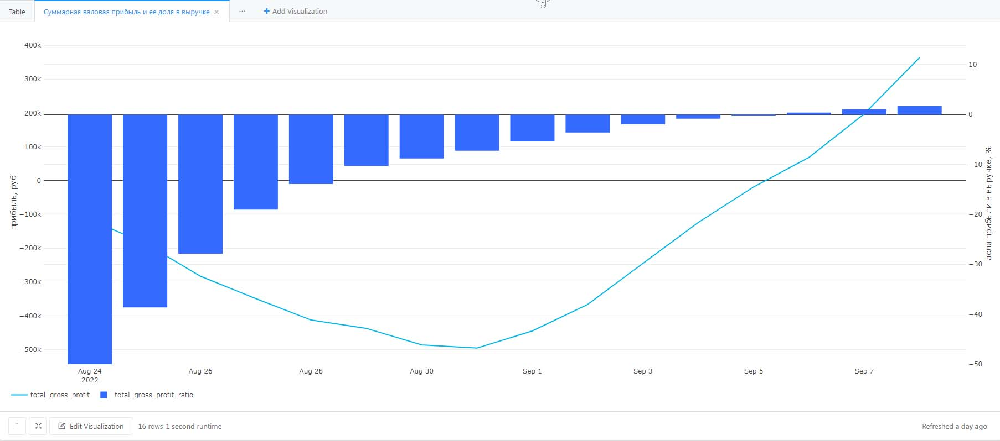


#### 2.6
**_Для каждого товара_** за весь период времени рассчитайте следующие показатели:
- Суммарную **_выручку_**, полученную от продажи этого товара за весь период.
- **_Долю выручки_** от продажи этого товара **_в общей выручке_**, полученной за весь период.

Товары, округлённая доля которых в выручке составляет менее 0.5%, объедините в общую группу с названием «ДРУГОЕ» 

```sql
WITH
    splited_orders as (
        SELECT
            unnest (product_ids) product_id
        FROM
            orders
        WHERE
            not exists (SELECT *
                        FROM user_actions
                        WHERE  action = 'cancel_order'
                                and orders.order_id = user_actions.order_id)
        ),

    total(total_sum) as (
        SELECT
            sum(price)
        FROM
            splited_orders
            LEFT JOIN products using (product_id)
    ),

    product_sums as (
        SELECT
            name product_name,
            sum(price) revenue,
            round(100.0 * sum(price) / total_sum, 2) share_in_revenue
        FROM
            splited_orders
            LEFT JOIN products using (product_id)
            CROSS JOIN total
        GROUP BY
            product_name,
            total_sum
    ),

    product_sums_with_others as (
        SELECT
            CASE
                WHEN share_in_revenue < 0.5 THEN 'ДРУГОЕ'
                ELSE product_name
                END as product_name,
            revenue,
            share_in_revenue
        FROM
            product_sums
    )

SELECT
    product_name,
    sum(revenue) revenue,
    sum(share_in_revenue) share_in_revenue
FROM
    product_sums_with_others
GROUP BY
    product_name
ORDER BY
    revenue desc
```


#### 2.5
**_Для каждого дня_** рассчитайте следующие показатели:
- **_Выручку_**, полученную в этот день.
- **_Выручку с заказов новых пользователей_**, полученную в этот день.
- **_Долю выручки_** с заказов **_новых пользователей_** в общей выручке, полученной за этот день.
- **_Долю выручки_** с заказов **_остальных пользователей_** в общей выручке, полученной за этот день.

```sql
WITH
    splited_orders as(
        SELECT
            order_id,
            user_id,
            creation_time::date date,
            unnest (product_ids) product_id
        FROM
            orders
            LEFT JOIN user_actions using(order_id)
        WHERE
            not exists (SELECT *
                        FROM   user_actions
                        WHERE  action = 'cancel_order'
                                and orders.order_id = user_actions.order_id)
    ),

    users_first_date as (
        SELECT DISTINCT
            user_id,
            min(time)::date as first_date
        FROM
            user_actions
        GROUP BY
            user_id
    ),

    order_sums as (
        SELECT
            date,
            sum(price) revenue,
            sum(price) filter(WHERE (so.user_id, so.date) in (SELECT user_id, first_date FROM users_first_date)) new_users_revenue
        FROM
            splited_orders so
            LEFT JOIN products p ON so.product_id = p.product_id
        GROUP BY date
)

SELECT
    date,
    revenue,
    new_users_revenue,
    round(100 * new_users_revenue / revenue, 2) new_users_revenue_share,
    round(100 * (revenue - new_users_revenue) / revenue, 2) old_users_revenue_share
FROM
    order_sums
ORDER BY
    date
```

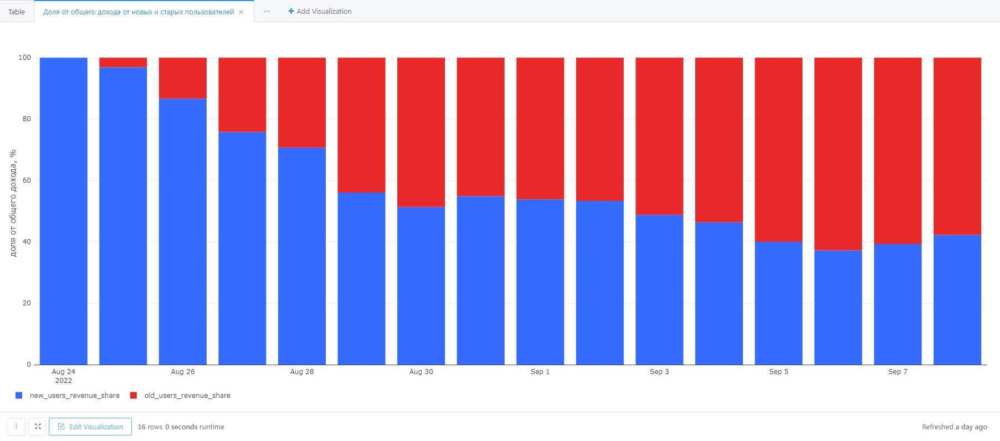


#### 2.4
**_Для каждого дня недели_** рассчитайте следующие показатели:
- Выручку на пользователя (**_ARPU_**).
- Выручку на платящего пользователя (**_ARPPU_**).
- Выручку на заказ (**_AOV_**).

```sql
WITH
    splited_orders AS(
        SELECT
            order_id,
            creation_time,
            UNNEST (product_ids) product_id
        FROM
            orders
        WHERE
            NOT EXISTS (SELECT *
                        FROM user_actions
                        WHERE action = 'cancel_order'
                                AND orders.order_id = user_actions.order_id)
            AND creation_time BETWEEN '2022-08-26' AND '2022-09-09'
    ),

    order_sums AS (
        SELECT
            TO_CHAR(creation_time, 'Day') weekday,
            DATE_PART('isodow', creation_time) weekday_number,
            SUM(price) revenue
        FROM
            splited_orders so
            LEFT JOIN products p ON so.product_id = p.product_id
        GROUP BY
            weekday, weekday_number
    ),

    counter AS (
        SELECT
            TO_CHAR(time, 'Day') weekday,
            DATE_PART('isodow', time) weekday_number,
            COUNT(DISTINCT user_id) active_users,
            COUNT(DISTINCT user_id)
                    FILTER(WHERE NOT EXISTS
                    (SELECT * FROM user_actions ua2
                    WHERE ua1.order_id = ua2.order_id
                    AND action = 'cancel_order')) paying_users,
            COUNT(DISTINCT order_id)
                    FILTER(WHERE NOT EXISTS
                    (SELECT * FROM user_actions ua2
                    WHERE ua1.order_id = ua2.order_id
                    AND action = 'cancel_order')) order_count
        FROM
            user_actions ua1
        WHERE
            time BETWEEN '2022-08-26' AND '2022-09-09'
        GROUP BY
            weekday, weekday_number
    )

SELECT
    weekday,
    weekday_number,
    ROUND(revenue / active_users, 2) arpu,
    ROUND(revenue / paying_users, 2) arppu,
    ROUND(revenue / order_count, 2) aov
FROM
    order_sums
    INNER JOIN counter USING (weekday, weekday_number)
ORDER BY
    weekday_number
```

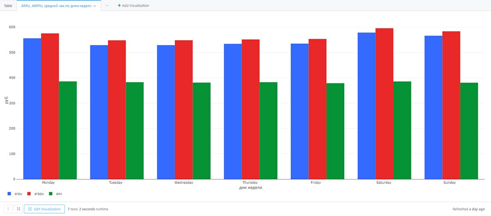


#### 2.3
**_Для каждого дня_** рассчитайте следующие показатели:
- Накопленную выручку на пользователя (**_Running ARPU_**).
- Накопленную выручку на платящего пользователя (**_Running ARPPU_**).
- Накопленную выручку с заказа, или средний чек (_**Running AOV**_).

```sql
WITH
    splited_orders AS(
        SELECT
            order_id,
            creation_time,
            UNNEST (product_ids) product_id
        FROM
            orders
        WHERE NOT EXISTS (SELECT * FROM user_actions
                            WHERE action = 'cancel_order'
                            AND orders.order_id = user_actions.order_id)
    ),

    order_sums AS (
        SELECT
            creation_time::DATE date,
            SUM(price) revenue
        FROM
            splited_orders so
            LEFT JOIN products p ON so.product_id = p.product_id
        GROUP BY
            date
    ),

    users_first_order_date AS (
        SELECT
            user_id,
            MIN(time)::DATE AS date
        FROM
            user_actions ua1
        WHERE NOT EXISTS (SELECT * FROM user_actions ua2
                            WHERE ua1.order_id = ua2.order_id
                            AND action = 'cancel_order')
        GROUP BY
            user_id
    ),

    paying_user_count AS (
        SELECT
            date,
            COUNT(DISTINCT user_id) paying_users
        FROM
            users_first_order_date
        GROUP BY
            date
    ),

    users_first_date AS (
        SELECT
            user_id,
            MIN(time)::DATE AS date
        FROM
            user_actions
        GROUP BY
            user_id
    ),

    active_user_count AS (
        SELECT
            date,
            COUNT(DISTINCT user_id) active_users
        FROM
            users_first_date
        GROUP BY
            date
    ),

    order_counter AS (
        SELECT
            time::DATE date,
            COUNT(DISTINCT order_id) order_count
        FROM
            user_actions ua1
        WHERE NOT EXISTS (SELECT * FROM user_actions ua2
                            WHERE ua1.order_id = ua2.order_id
                            AND action = 'cancel_order')
        GROUP BY
            date
    )


SELECT
    date,
    ROUND(SUM(revenue) OVER(ORDER BY date) / SUM(active_users) OVER(ORDER BY date), 2) running_arpu,
    ROUND(SUM(revenue) OVER(ORDER BY date) / SUM(paying_users) OVER(ORDER BY date), 2) running_arppu,
    ROUND(SUM(revenue) OVER(ORDER BY date) / SUM(order_count) OVER(ORDER BY date), 2) running_aov
FROM
    order_sums
    INNER JOIN paying_user_count USING (date)
    INNER JOIN active_user_count USING (date)
    INNER JOIN order_counter USING (date)
```

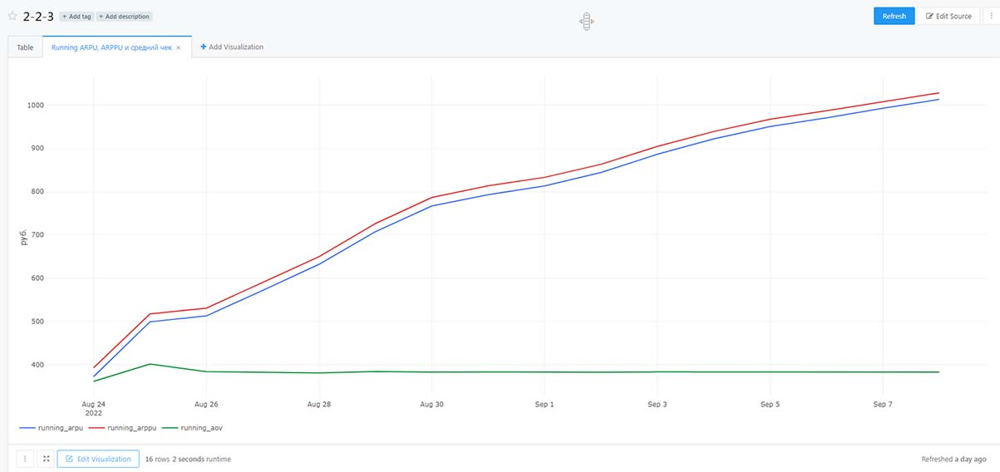


#### 2.2
**_Для каждого дня_** рассчитайте следующие показатели:
- Выручку на пользователя (**_ARPU_**) за текущий день.
- Выручку на платящего пользователя (**_ARPPU_**) за текущий день.
- Выручку с заказа, или средний чек (**_AOV_**) за текущий день.

```sql
WITH
    splited_orders AS(
        SELECT
            order_id,
            creation_time,
            UNNEST (product_ids) product_id
        FROM
            orders
        WHERE
            NOT EXISTS (SELECT *
                        FROM user_actions
                        WHERE action = 'cancel_order'
                                AND orders.order_id = user_actions.order_id)
    ),

    order_sums AS (
        SELECT
            creation_time::DATE date,
            SUM(price) revenue
        FROM
            splited_orders so
            LEFT JOIN products p ON so.product_id = p.product_id
        GROUP BY
            date
    ),

    counter AS (
        SELECT
            time::DATE date,
            COUNT(DISTINCT user_id) active_users,
            COUNT(DISTINCT user_id) FILTER(WHERE NOT EXISTS
                    (SELECT * FROM user_actions ua2
                    WHERE ua1.order_id = ua2.order_id
                    AND action = 'cancel_order')) paying_users,
            COUNT(DISTINCT order_id) FILTER(WHERE NOT EXISTS
                    (SELECT * FROM user_actions ua2
                    WHERE ua1.order_id = ua2.order_id
                    AND action = 'cancel_order')) order_count
        FROM
            user_actions ua1
        GROUP BY
            date
    )

SELECT
    date,
    ROUND(revenue / active_users, 2) arpu,
    ROUND(revenue / paying_users, 2) arppu,
    ROUND(revenue / order_count, 2) aov
FROM
    order_sums
    INNER JOIN counter USING (date)
```

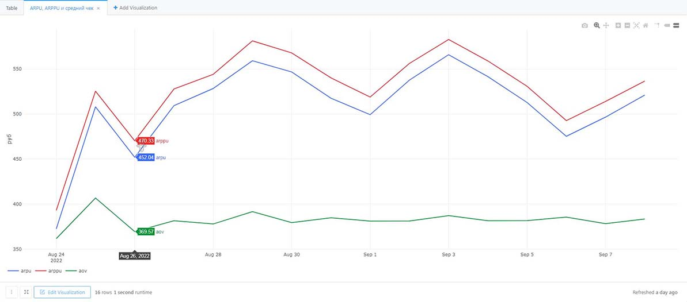


#### 2.1
**_Для каждого дня_** рассчитайте следующие показатели:
- **_Выручку_**, полученную в этот день.
- **_Суммарную выручку_** на текущий день.
- **_Прирост выручки_**, полученной в этот день, относительно значения выручки за предыдущий день.

```sql
WITH
    splited_orders AS(
        SELECT
            order_id,
            creation_time,
            UNNEST (product_ids) product_id
        FROM
            orders
        WHERE
            NOT EXISTS (SELECT *
                        FROM user_actions
                        WHERE action = 'cancel_order'
                                AND orders.order_id = user_actions.order_id)
    ),

    order_sums AS (
        SELECT
            creation_time::DATE date,
            SUM(price) revenue
        FROM
            splited_orders so
            INNER JOIN products p ON so.product_id = p.product_id
        GROUP BY
            date
    )

SELECT
    date,
    revenue,
    SUM(revenue) OVER(ORDER BY date) total_revenue,
    ROUND(100.0 * (revenue - LAG(revenue, 1) OVER()) / LAG(revenue, 1) OVER(), 2) AS revenue_change
FROM
    order_sums
```

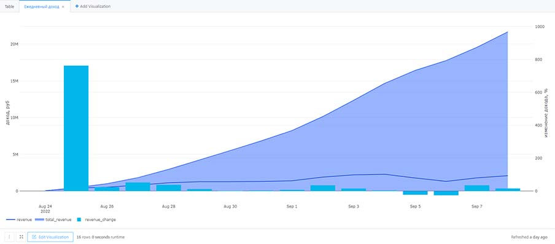


## ПОСТРОЕНИЕ ДАШБОРДОВ 

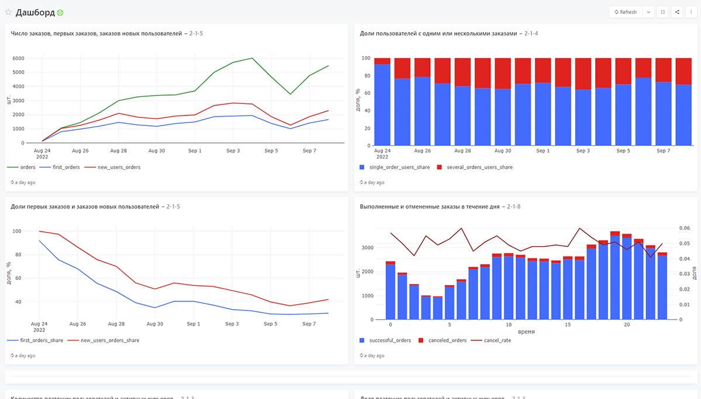

#### 1.8
**_Для каждого часа_** в сутках рассчитайте следующие показатели:
- **_Число_** успешных (**_доставленных_**) **_заказов_**.
- Число **_отменённых_** заказов.
- **_Долю отменённых_** заказов в общем числе заказов (cancel rate).

```sql
WITH
  amounts AS (
    SELECT
      DATE_PART('hour', creation_time)::INT AS hour,
      COUNT(*) FILTER (WHERE order_id NOT IN (SELECT order_id FROM user_actions WHERE action = 'cancel_order')) successful_orders,
      COUNT(*) FILTER (WHERE order_id IN (SELECT order_id FROM user_actions WHERE action = 'cancel_order')) canceled_orders
    FROM
      orders
    GROUP BY
      hour
  )

SELECT
  *,
  ROUND(1.0 * canceled_orders / (canceled_orders + successful_orders), 3) cancel_rate
FROM
  amounts
ORDER BY
  hour
```

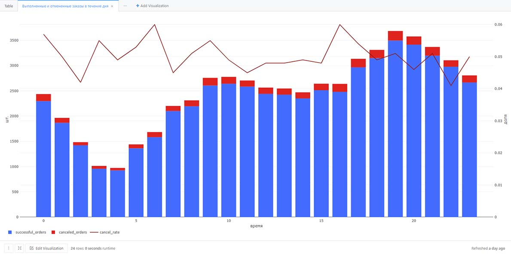


#### 1.7
**_Для каждого дня рассчитайте, за сколько секунд в среднем курьеры доставляли свои заказы_**.

```sql
WITH
  times_to_deliver AS (
    SELECT
      order_id,
      EXTRACT(epoch FROM MAX(time) - MIN(time)) time_to_deliver,
      MAX(time)::DATE date
    FROM
      courier_actions
    WHERE
      order_id IN (SELECT order_id FROM courier_actions WHERE action='deliver_order')
    GROUP BY
      order_id
)


SELECT
  date,
  ROUND(AVG(time_to_deliver))::INT seconds_to_deliver
FROM
  times_to_deliver
GROUP BY
  date
ORDER BY
  date
```

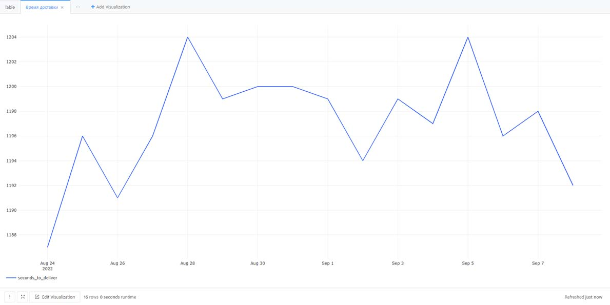


#### 1.6
**_Для каждого дня_** рассчитайте следующие показатели:
- **_Число платящих пользователей на одного активного курьера_**.
- **_Число заказов_** на одного активного курьера.

```sql
WITH
  users_data AS (
    SELECT
      time::DATE AS date,
      COUNT(DISTINCT user_id) paying_users,
      COUNT(DISTINCT order_id) orders_amount
    FROM
      user_actions
    WHERE
      order_id NOT IN (SELECT order_id FROM user_actions WHERE action = 'cancel_order')
    GROUP BY
      date
  ),

  couriers_activity AS (
    SELECT
      time::DATE AS date,
      COUNT(DISTINCT courier_id) active_users
    FROM
      courier_actions
    WHERE
      order_id IN (SELECT order_id FROM courier_actions WHERE action = 'deliver_order')
      AND action = 'accept_order'
    GROUP BY
      date
  )


SELECT
  date,
  ROUND(1.0 * paying_users / active_users, 2) users_per_courier,
  ROUND(1.0 * orders_amount / active_users, 2) orders_per_courier
FROM
  users_data
  INNER JOIN couriers_activity USING(date)
```

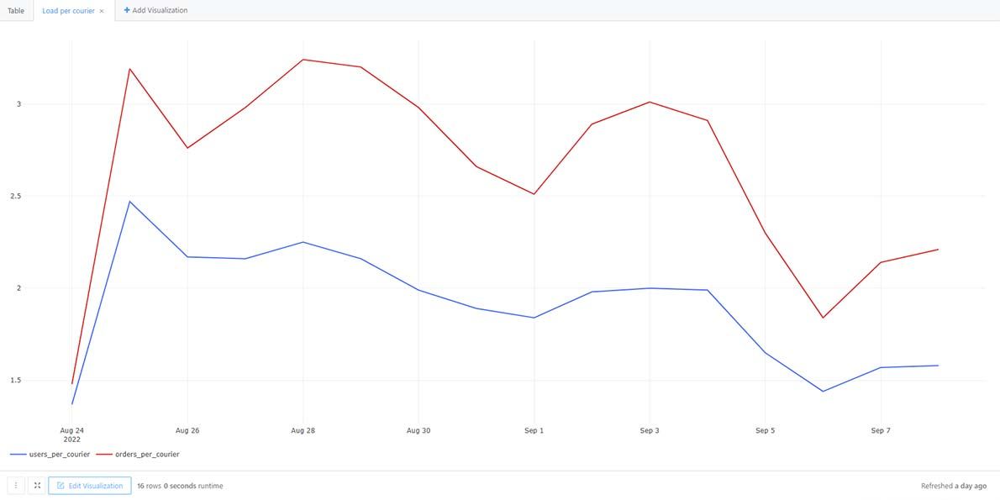


#### 1.5
**_Для каждого дня_**, рассчитайте следующие показатели:
- Общее **_число заказов_**.
- **_Число первых заказов_** (заказов, сделанных пользователями впервые).
- **_Число заказов новых пользователей_** (заказов, сделанных пользователями в тот же день, когда они впервые воспользовались сервисом).
- **_Долю первых заказов_** в общем числе заказов (долю п.2 в п.1).
- **_Долю заказов новых пользователей_** в общем числе заказов (долю п.3 в п.1).

```sql
WITH
  users_first_order_date AS (
    SELECT
      user_id,
      MIN(time)::DATE AS date
    FROM
      user_actions
    WHERE
       order_id NOT IN (SELECT order_id FROM user_actions WHERE action='cancel_order')
    GROUP BY
      user_id
  ),

  users_first_date AS (
    SELECT
      user_id,
      MIN(time)::DATE AS date
    FROM
      user_actions
    GROUP BY
      user_id
  ),

  users_order_counter AS (
    SELECT
      time::DATE AS date,
      user_id,
      COUNT(*) amount
    FROM
      user_actions
    WHERE
      order_id NOT IN (SELECT order_id FROM user_actions WHERE action='cancel_order')
          AND action = 'create_order'
    GROUP BY
      date,
      user_id
  ),

  first_amounts AS (
    SELECT
      date,
      SUM(amount)::INTEGER orders,
      (COUNT(*) FILTER(WHERE (user_id, date) IN (SELECT * FROM users_first_order_date)))::INTEGER first_orders,
      (SUM(amount) FILTER(WHERE (user_id, date) IN (SELECT * FROM users_first_date)))::INTEGER new_users_orders
    FROM
      users_order_counter
    GROUP BY
      date
      )

SELECT
  date,
  orders,
  first_orders,
  new_users_orders,
  ROUND(100.0 * first_orders / orders, 2) first_orders_share,
  ROUND(100.0 * new_users_orders / orders, 2) new_users_orders_share
FROM
  first_amounts
ORDER BY
  date
```

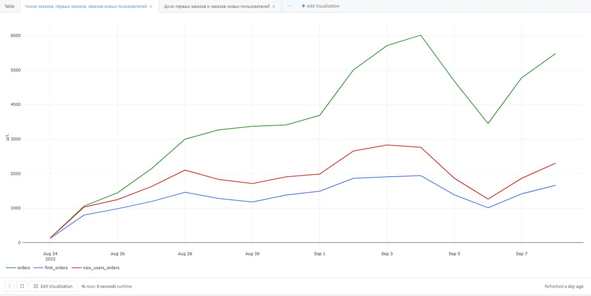
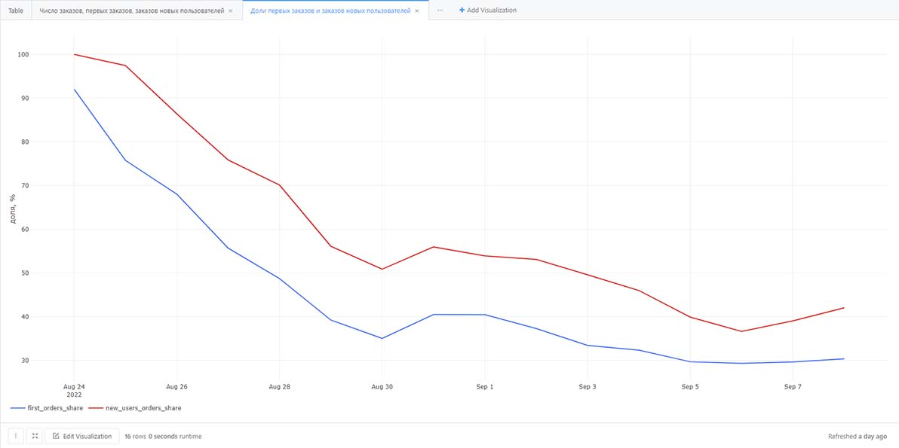


#### 1.4
**_Для каждого дня_**, рассчитайте следующие показатели:
- **_Долю пользователей, сделавших в этот день всего один заказ_**, в общем количестве платящих пользователей.
- Долю пользователей, сделавших в этот день **_несколько заказов_**, в общем количестве платящих пользователей.

```sql
WITH
  users_orders AS (
    SELECT
      time::DATE date,
      user_id,
      COUNT(*) today_amount
    FROM
      user_actions
    WHERE
      order_id NOT IN (SELECT order_id FROM user_actions WHERE action='cancel_order')
      and action = 'create_order'
    GROUP BY
      date,
      user_id)

SELECT
  date,
  ROUND(100.0 * COUNT(*) FILTER(WHERE today_amount = 1) / COUNT(*), 2) single_order_users_share,
  ROUND(100.0 * COUNT(*) FILTER(WHERE today_amount > 1) / COUNT(*), 2) several_orders_users_share
FROM
  users_orders
GROUP BY
  date
ORDER BY
  date
```

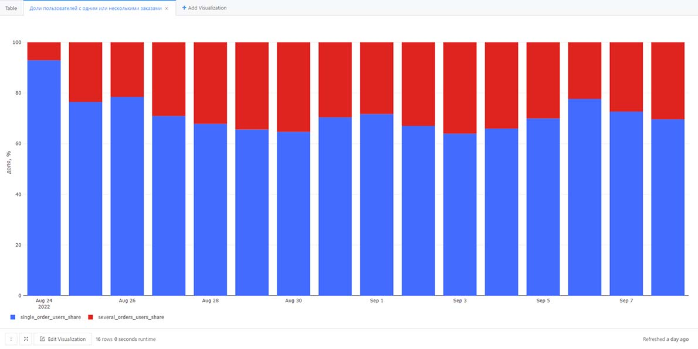


#### 1.3
**_Для каждого дня_**, рассчитайте следующие показатели:
- **_Число платящих пользователей_**.
- **_Число активных курьеров_**.
- **_Долю платящих пользователей_** в общем числе пользователей на текущий день.
- **_Долю активных курьеров_** в общем числе курьеров на текущий день.

```sql
WITH
  users_min_dates AS (
    SELECT
      MIN(time)::DATE AS date
    FROM
      user_actions
    GROUP BY
      user_id
  ),

  users_counts_by_date AS (
    SELECT
      date,
      COUNT(*) new_users
    FROM
      users_min_dates
    GROUP BY
      date
  ),

  couriers_min_dates AS (
    SELECT
      MIN(time)::DATE AS date
    FROM
      courier_actions
    GROUP BY
      courier_id
  ),

  couriers_counts_by_date AS (
    SELECT
      date,
      COUNT(*) new_couriers
    FROM
      couriers_min_dates
    GROUP BY
      date
  ),

  amount_table AS (
    SELECT
      date,
      (SUM(new_users) OVER(ORDER BY date))::INTEGER total_users,
      (SUM(new_couriers) OVER(ORDER BY date))::INTEGER total_couriers
    FROM
      users_counts_by_date u
      INNER JOIN couriers_counts_by_date USING(date)
  ),

  paying_users_number AS (
    SELECT
      time:: DATE date,
      COUNT(DISTINCT user_id) paying_users
    FROM
      user_actions
    WHERE
      order_id NOT IN (SELECT order_id FROM user_actions WHERE action='cancel_order')
    GROUP BY
      1),

  active_couriers_number AS (
    SELECT
      time:: DATE date,
      COUNT(DISTINCT courier_id) active_couriers
    FROM
      courier_actions
    WHERE
      order_id IN (SELECT order_id FROM courier_actions WHERE action='deliver_order')
      AND action='accept_order'
    GROUP BY
      1)


SELECT
  date,
  paying_users,
  active_couriers,
  ROUND(100.0 * paying_users / total_users, 2) paying_users_share,
  ROUND(100.0 * active_couriers / total_couriers, 2) active_couriers_share
FROM
  paying_users_number
  FULL JOIN active_couriers_number USING(date)
  FULL JOIN amount_table USING(date)
```

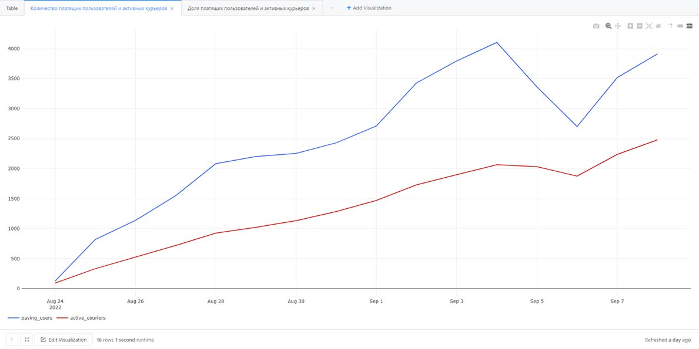


#### 1.2
Теперь **_для каждого дня дополнительно_** рассчитайте следующие показатели:
- **_Прирост числа новых пользователей_**.
- Прирост числа новых **_курьеров_**.
- **_Прирост общего числа пользователей_**.
- Прирост общего числа **_курьеров_**.

```sql
WITH
  users_min_dates AS (
    SELECT
      MIN(time)::DATE AS date
    FROM
      user_actions
    GROUP BY
      user_id
  ),

  users_counts_by_date AS (
    SELECT
      date,
      COUNT(*) new_users
    FROM
      users_min_dates
    GROUP BY
      date
  ),

  couriers_min_dates AS (
    SELECT
      MIN(time)::DATE AS date
    FROM
      courier_actions
    GROUP BY
      courier_id
  ),

  couriers_counts_by_date AS (
    SELECT
      date,
      COUNT(*) new_couriers
    FROM
      couriers_min_dates
    GROUP BY
      date
  ),

  amount_table AS (
    SELECT
      date,
      new_users,
      new_couriers,
      (SUM(new_users) OVER(ORDER BY date))::INTEGER total_users,
      (SUM(new_couriers) OVER(ORDER BY date))::INTEGER total_couriers
    FROM
      users_counts_by_date u
      INNER JOIN couriers_counts_by_date USING(date)
  )

SELECT
  date,
  new_users,
  new_couriers,
  total_users,
  total_couriers,
  ROUND(100.0 * (new_users - LAG(new_users) OVER()) / LAG(new_users) OVER(), 2) new_users_change,
  ROUND(100.0 * (new_couriers - LAG(new_couriers) OVER()) / LAG(new_couriers) OVER(), 2) new_couriers_change,
  ROUND(100.0 * (total_users - LAG(total_users) OVER()) / LAG(total_users) OVER(), 2) total_users_growth,
  ROUND(100.0 * (total_couriers - LAG(total_couriers) OVER()) / LAG(total_couriers) OVER(), 2) total_couriers_growth
FROM
  amount_table
```


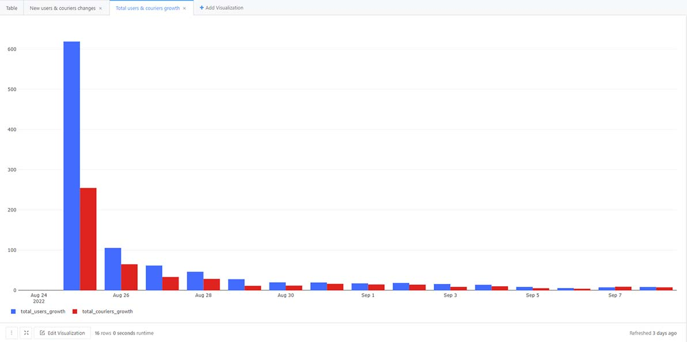


#### 1.1
**_Для каждого дня_** рассчитайте следующие показатели:
- **_Число новых пользователей_**.
- **_Число новых курьеров_**.
- **_Общее число пользователей на текущий день_**.
- **_Общее число курьеров_** на текущий день.

```sql
WITH
  users_min_dates AS (
    SELECT
      MIN(time)::DATE AS date
    FROM
      user_actions
    GROUP BY
      user_id
  ),

  users_counts_by_date AS (
    SELECT
      date,
      COUNT(*) new_users
    FROM
      users_min_dates
    GROUP BY
      date
  ),

  couriers_min_dates AS (
    SELECT
      MIN(time)::DATE AS date
    FROM
      courier_actions
    GROUP BY
      courier_id
  ),

  couriers_counts_by_date AS (
    SELECT
      date,
      COUNT(*) new_couriers
    FROM
      couriers_min_dates
    GROUP BY
      date
  )

SELECT
  date,
  new_users,
  new_couriers,
  (SUM(new_users) OVER(ORDER BY date))::INTEGER total_users,
  (SUM(new_couriers) OVER(ORDER BY date))::INTEGER total_couriers
FROM
  users_counts_by_date u
  INNER JOIN couriers_counts_by_date USING(date)
```

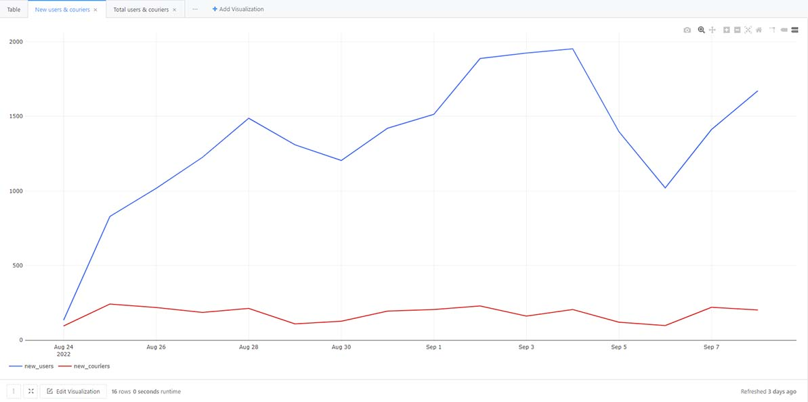
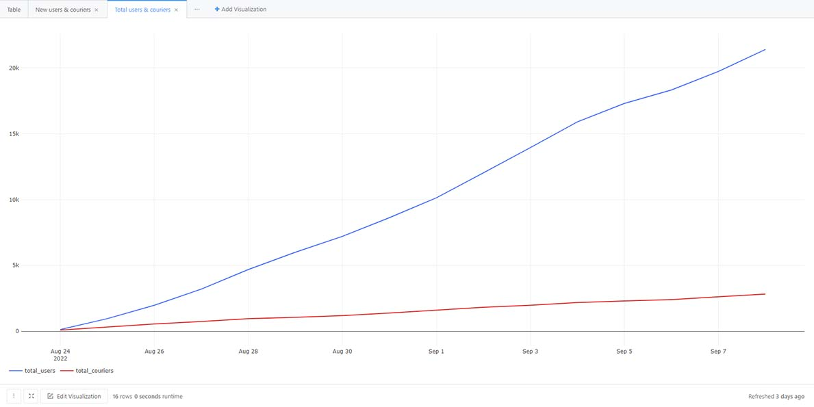


