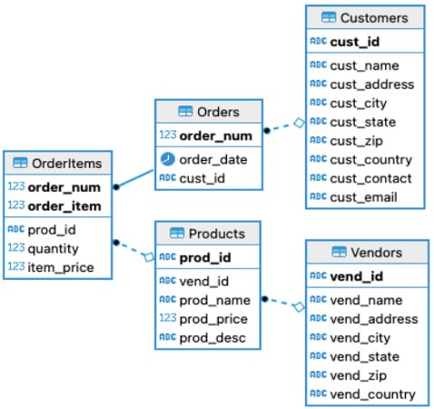

# Тестовое от одного банка
https://t.me/c/2035525785/155

Схема данных:  


Задачи:
1. Выделить поставщиков (Vendors), которые в 2021 году не продали ни одного зонта (зонты ищем в prod_desc).
2. Вычислить одним запросом среднюю стоимость заказа в разбивке по годам (из order_date) для американских 
(vend_country = ‘USA’) и неамериканких поставщиков.
3. Вывести адреса и имена покупателей, сделавших более 10 заказов.
4. Предположим, что все продукты делятся на 3 группы – зонты, диваны и шляпы (при этом в prod_desc указана по-русски 
и группа, и конкретная модель). Для каждой группы продуктов нужно вывести минимальную, максимальную 
и среднюю стоимость товара и среднее кол-во товаров такого типа в одном заказе. 
5. Вывести имена покупателя и для каждого из них кол-во заказов, в которых фактическая цена продукта 
(orderitems.item_price) не равна изначальной цене (products.prod_price).
6. Одним запросом посчитать стоимость каждого заказа и разбить все заказы на корзины по стоимости: 
до 5000, 5000 – 10000, 10000 – 15000 , 15000 – 20000  и т.д.  (верхняя граница неизвестна, 
продолжаем разбиение по 5000 до верхней границы, группа «от 20000 и более» не является верным ответом). 
Формат вывода: корзина (в любой понятной форме), кол-во заказов. Циклы не используем.   

## Задача 1
Выделить поставщиков (Vendors), которые в 2021 году не продали ни одного зонта (зонты ищем в prod_desc).
Корнер кейсы. Если вендор не производит зонтов 
```sql
SELECT
    vend_name
FROM
    Vendors vnd 
    LEFT JOIN Products prd USING (vend_id)
    LEFT JOIN OrderItems USING (prod_id)
    LEFT JOIN Orders USING (order_num)
WHERE
    prod_name LIKE 'Зонт%'
    AND EXTRACT(YEAR from order_date) = 2021
GROUP BY
    vend_name
HAVING
    SUM(quantity) IS NULL
```
